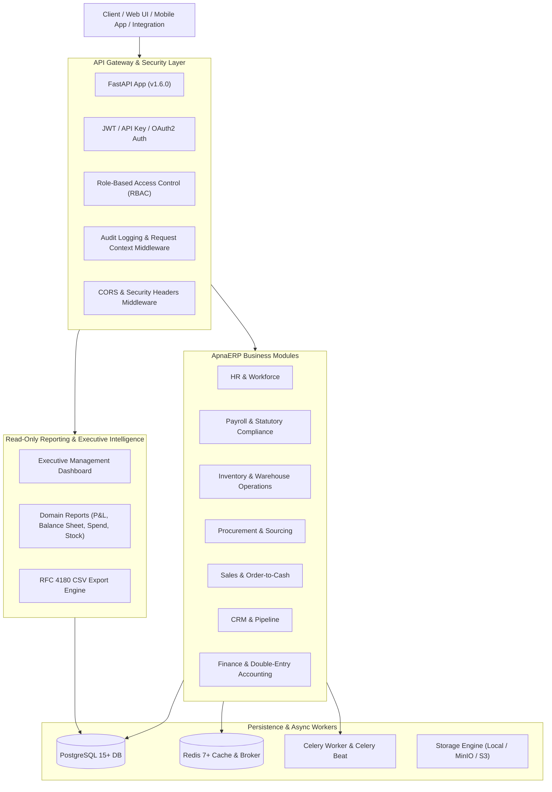

# ApnaERP — Enterprise Resource Planning Platform (v1.6.0)

[](https://fastapi.tiangolo.com)
[](https://www.python.org/)
[](https://www.sqlalchemy.org/)
[](https://www.postgresql.org/)
[](https://redis.io)
[](https://docs.celeryq.dev/)
[](https://www.docker.com/)
[](tests/)

**ApnaERP** is a modular, high-performance, production-ready Enterprise Resource Planning (ERP) backend platform built with **Python**, **FastAPI**, **SQLAlchemy 2.0 (Async)**, **PostgreSQL**, **Redis**, and **Celery**.

Spanning 9 fully integrated business and operational domains, ApnaERP provides a robust, strictly typed, RBAC-protected API for small-to-medium enterprise operations.

---

## 1. System Architecture



---

## 2. Core Business Domains

### 2.1 Platform & Infrastructure Foundation
- **JWT Authentication & OAuth2**: Secure registration, login, token refresh, and user profile management.
- **Granular RBAC**: Role-based access control with granular permissions (`domain.action`), dynamic roles, and user-role assignments.
- **Canonical Audit Logging**: Automated tracking of user identity, IP address, timestamp, action, and JSON state diffs (`old_values` vs `new_values`).
- **File & Document Management**: Upload, storage, metadata indexing, MIME validation, and secure retrieval.

### 2.2 Human Resources (HR)
- **Workforce Management**: Employees, job positions, departments, direct-report hierarchies, employment types, and profiles.
- **Attendance Engine**: Work shifts, check-in/check-out tracking, worked hours, late arrivals, half-days, and overnight shifts.
- **Leave Management**: Leave types, annual leave entitlement balances, accrual policies, and multi-step approval workflows.
- **Holiday Calendars**: Organization-wide and regional public holiday schedules.

### 2.3 Payroll & Statutory Compliance
- **Salary Configuration**: Modular salary components (Earnings, Deductions), calculation methods (Flat, Percentage of Basic), and structures.
- **Employee Compensation**: Salary structure assignment, effective dates, CTC calculations, and revision history.
- **Payroll Processing**: Automated batch payroll runs, tax/PF/ESI deductions, net pay computation, payslip generation, and bank export files.

### 2.4 Inventory & Warehouse Operations
- **Product Master**: Hierarchical product categories, units of measure (UOM), brands, stocking parameters, and reorder levels.
- **Warehouse Management**: Multi-warehouse facilities, storage locations, and aisle/rack/shelf hierarchy.
- **Stock Movement Engine**: Inward goods receipt (GRN), goods issue (GIN), inter-warehouse stock transfers, and real-time physical balance tracking.
- **Advanced Tracking**: Batch/lot numbers, expiration date tracking, serial numbers, and reserved stock allocations.

### 2.5 Procurement & Sourcing
- **Supplier Master**: Vendor profiles, contact persons, tax IDs, performance ratings, and status lifecycle.
- **Sourcing Lifecycle**: Purchase Requisitions (PR) $\rightarrow$ Requests for Quotation (RFQ) $\rightarrow$ Supplier Quotations comparison matrix $\rightarrow$ Awarding.
- **Purchase Orders (PO)**: Sequential PO numbering, tax/subtotal calculation, multi-level approval workflows, and amendment revisions.
- **Receiving & Returns**: Goods receipt linking, partial receiving, inspection, and purchase return stock reversals.

### 2.6 Sales & Commercial Orders
- **Customer Master**: Customer profiles, categories, contacts, billing/shipping addresses, credit limits, and document attachments.
- **Sales Quotations**: Quotation generation, line-item pricing, customer discount rules, tax computation, and expiration tracking.
- **Sales Orders (SO)**: Order approval with credit limit checks, delivery order dispatches, stock allocation, and sales returns.
- **Quotation-to-Order Conversion**: Automated atomic conversion of approved quotations into sales orders.

### 2.7 Customer Relationship Management (CRM)
- **Lead Management**: Automated lead scoring, duplicate detection, lead assignment, and status lifecycle (`New` $\rightarrow$ `Contacted` $\rightarrow$ `Qualified` $\rightarrow$ `Converted`).
- **Opportunity Pipeline**: Deal progression across customizable stages (`Prospecting`, `Proposal`, `Negotiation`, `Won`, `Lost`) with win probability.
- **Atomic Lead Conversion**: Concurrency-safe conversion creating or reusing canonical Sales Customers.
- **Activities & Calendar**: History tracking for calls, meetings, emails, notes, and task dependency trees.

### 2.8 Finance & Core Accounting
- **Legal Entity Configuration**: Company profile, base currency designation, and fiscal year alignment.
- **Hierarchical Chart of Accounts**: Multi-level account groups (Assets, Liabilities, Equity, Revenue, Expense) with circular hierarchy prevention.
- **Fiscal Calendar**: Automated 12-month period generation, period locking, and period/year-end closings.
- **Double-Entry Journal Engine**: Mandatory double-entry validation ($\sum \text{Debit} \equiv \sum \text{Credit}$), posting guards, immutability, and counter-balancing reversals.
- **General Ledger & Trial Balance**: Real-time account ledgers, chronological transaction history, and mathematical trial balance verification.

### 2.9 Centralized Reporting & Executive Dashboard
- **Executive Management Dashboard** (`/api/v1/reports/dashboard`): Unified real-time KPIs across all 7 operational domains.
- **Financial Statements**: Trial Balance, Profit & Loss statement, and Balance Sheet.
- **Operational Summaries**: Sales summaries, customer totals, procurement spend, stock levels, low-stock alerts, workforce headcount, and payroll breakdowns.
- **RFC 4180 CSV Export**: Standardized streaming CSV exports for all reports.

---

## 3. Technology Stack

| Layer | Technology |
| :--- | :--- |
| **Language** | Python 3.10+ |
| **API Framework** | FastAPI (ASGI, Async/Await) |
| **Database ORM** | SQLAlchemy 2.0 (Async Engine & Session) |
| **Database** | PostgreSQL 15+ (Production) / SQLite + aiosqlite (Testing) |
| **Database Migrations** | Alembic |
| **Task Queue & Workers** | Celery 5.4+ with Redis Broker |
| **Caching & In-Memory** | Redis 7+ |
| **Data Validation** | Pydantic v2 |
| **Security & Auth** | Passlib (Bcrypt), PyJWT (HS256) |
| **Observability** | Prometheus FastAPI Instrumentator, Structured Logging |
| **Containerization** | Docker, Docker Compose |
| **Testing** | Pytest, Pytest-Asyncio, HTTPX |

---

## 4. Getting Started & Local Setup

### 4.1 Prerequisites
- **Python 3.10+**
- **PostgreSQL 15+**
- **Redis 7+**
- **Git**

### 4.2 Installation Steps

1. **Clone the repository**:
   ```bash
   git clone https://github.com/SarthakZunjure17/ApnaERP.git
   cd ApnaERP
   ```

2. **Create and activate Python virtual environment**:
   ```bash
   # Windows (PowerShell)
   python -m venv .venv
   .venv\Scripts\Activate.ps1

   # Linux / macOS
   python3 -m venv .venv
   source .venv/bin/activate
   ```

3. **Install dependencies**:
   ```bash
   pip install -r requirements.txt
   ```

4. **Configure Environment Variables**:
   Copy the example environment file:
   ```bash
   cp .env.example .env
   ```
   Edit `.env` with your database and Redis credentials:
   ```env
   PROJECT_NAME=ApnaERP
   VERSION=1.6.0
   ENV=development
   DEBUG=True

   POSTGRES_SERVER=localhost
   POSTGRES_PORT=5432
   POSTGRES_USER=apnaerp_user
   POSTGRES_PASSWORD=apnaerp_password
   POSTGRES_DB=apnaerp_db

   REDIS_HOST=localhost
   REDIS_PORT=6379

   SECRET_KEY=your-super-secret-jwt-key-minimum-32-chars
   ```

5. **Run Database Migrations**:
   ```bash
   alembic upgrade head
   ```

6. **Seed Initial RBAC Data & Super Admin**:
   ```bash
   python -m app.db.seed_rbac
   ```
   *Default Admin Credentials:*
   - **Email:** `admin@apnaerp.com`
   - **Password:** `admin123`

7. **Start the API Server**:
   ```bash
   uvicorn app.main:app --host 0.0.0.0 --port 8000 --reload
   ```

8. **Start Celery Background Workers (Optional for async tasks)**:
   ```bash
   celery -A workers.celery_worker.celery_app worker --loglevel=info
   ```

---

## 5. Docker Deployment

To run the complete ApnaERP stack (API, PostgreSQL, Redis, Celery Worker, Celery Beat) using Docker Compose:

```bash
# Navigate to project root
docker-compose -f docker/docker-compose.yml up --build -d
```

### Services Started:
- **API Server:** `http://localhost:8000`
- **Interactive Swagger Docs:** `http://localhost:8000/docs`
- **ReDoc Documentation:** `http://localhost:8000/redoc`
- **PostgreSQL Database:** `localhost:5432`
- **Redis Cache & Broker:** `localhost:6379`
- **Celery Worker & Celery Beat:** Background asynchronous task processors

To stop the containers:
```bash
docker-compose -f docker/docker-compose.yml down
```

---

## 6. API Documentation & Diagnostics

When the application is running, interactive API documentation is automatically accessible:

- **Swagger UI (Interactive API Explorer):** [http://localhost:8000/docs](http://localhost:8000/docs)
- **ReDoc (API Specification):** [http://localhost:8000/redoc](http://localhost:8000/redoc)
- **OpenAPI Schema (JSON):** [http://localhost:8000/api/v1/openapi.json](http://localhost:8000/api/v1/openapi.json)
- **Prometheus Metrics:** [http://localhost:8000/metrics](http://localhost:8000/metrics)

### Health & Probe Endpoints
| Endpoint | Method | Purpose |
| :--- | :--- | :--- |
| `/` | `GET` | API welcome payload and version metadata |
| `/health` | `GET` | Aggregate system health check |
| `/health/liveness` | `GET` | Kubernetes liveness probe |
| `/health/readiness` | `GET` | Kubernetes readiness probe |
| `/health/db` | `GET` | Database latency and connectivity probe |
| `/health/redis` | `GET` | Redis cache ping and status probe |
| `/health/celery` | `GET` | Celery queue and broker health probe |

---

## 7. Testing & Quality Assurance

ApnaERP includes a comprehensive test suite covering all business modules, domain isolation boundaries, concurrency, and API integration.

```bash
# Run the complete test suite
pytest tests/ -v

# Run smoke integration test suite
pytest tests/test_final_integration_smoke.py -v

# Run reporting domain tests
pytest tests/test_reporting_foundation.py -v

# Run finance core tests
pytest tests/test_finance_foundation.py -v
```

### Test Suite Summary:
- **Total Tests:** 459+
- **Pass Rate:** 100% (0 failures, 0 regressions)
- **Coverage:** Unit, Integration, Concurrency, State Machine, Immutability, and RBAC security.

---

## 8. Key Architectural Boundaries & Invariants

1. **Strict Domain Isolation:**
   - The **Reporting Layer** is strictly read-only and never mutates operational data.
   - **Sales** and **Procurement** maintain separate quotation and order lifecycles.
   - **CRM** lead conversion reuses canonical `Customer` master records without duplicating entities.
2. **Financial Immutability:**
   - Posted General Ledger journals cannot be updated or deleted. Corrections must be executed via counter-balancing reversal journals (`REV-`).
3. **Double-Entry Validation:**
   - Journal entries require at least two lines with strictly balanced Debits and Credits ($\sum \text{Debit} \equiv \sum \text{Credit}$).
4. **Exact Decimal Precision:**
   - All financial and inventory amounts use exact numeric types (`Numeric(18, 4)` or `Numeric(12, 2)`) to eliminate floating-point arithmetic errors.

---

## 9. Final Project Status

ApnaERP is **feature-complete**, fully integrated, documented, and verified for production demonstration and college portfolio submission.

- **Milestone:** Final Integration & Project Finalization
- **Release Version:** `v1.6.0`
- **Build Status:** **COMPLETED**
