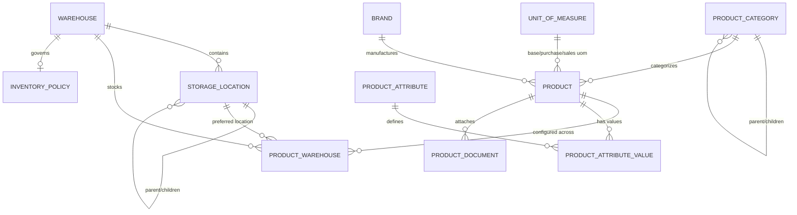

# ApnaERP — Inventory Foundation & Master Data Architecture (v0.6.0)

## Executive Summary
Milestone `v0.6.0` establishes the canonical, enterprise-grade Inventory Foundation for ApnaERP. It provides the core master data infrastructure required for physical and multi-warehouse operations, encompassing product cataloging, infinite category hierarchies, units of measure, warehouses, nested storage locations, multi-warehouse stocking parameters, and warehouse inventory policies.

---

## 1. Domain Entities & Data Model

### 1.1 Product Master (`Product`)
The central entity for all item management across the ERP:
- **Identification**: `sku` (Unique index), `barcode` (Unique index), `name`, `description`, `model_number`.
- **Classification**: `category_id` (FK to `ProductCategory`), `brand_id` (FK to `Brand`).
- **Units of Measure**: `base_unit_id` (Alias `base_uom_id`), `purchase_unit_id`, `sales_unit_id`.
- **Item Classification & Flags**:
  - `product_type`: `Inventory`, `Service`, `Consumable`, `Digital`, `Asset`, `Goods`, `Non-Stock`.
  - `is_active`: Boolean flag controlling entity lifecycle.
  - `is_stockable` (alias `track_inventory`): Determines whether stock ledger tracks physical quantities.
  - `is_sellable`: Enables ordering on Sales Orders and Quotations.
  - `is_purchasable`: Enables procurement via Purchase Orders and RFQs.
- **Stock Thresholds & Logistics**:
  - `reorder_level`: Default catalog reorder trigger point.
  - `reorder_quantity`: Standard replenishment order batch quantity.
  - `minimum_stock` / `maximum_stock`: Buffer safety floor and warehouse ceiling.
  - `lead_time_days`: Estimated supplier procurement lead time.
  - `default_unit_price`: Standard base selling price.
  - `default_warehouse_id`: Default fulfillment facility.
  - `weight`, `height`, `width`, `length`, `volume`: Physical dimensions.
- **Extensible Attributes**: `metadata_json` (JSON dictionary for custom catalog attributes).
- **Status State Machine**: `Draft` &rarr; `Active` &rarr; `Discontinued` &rarr; `Archived` (Archived records are immutable).

### 1.2 Multi-Warehouse Architecture (`ProductWarehouse`)
Enables enterprise multi-facility stocking policies with per-warehouse reorder parameters:
- `product_id` + `warehouse_id`: Unique constraint `(product_id, warehouse_id)`.
- `preferred_location_id`: Default bin/shelf within the target facility (strictly verified against `warehouse_id`).
- `reorder_level`: Facility-specific replenishment trigger.
- `reorder_quantity`: Recommended purchase/transfer quantity.
- `minimum_stock` / `maximum_stock`: Facility safety buffer floor and max storage capacity.
- `safety_stock`: Dedicated safety stock buffer.
- `is_active`: Facility stocking status.

### 1.3 Inventory Policies (`InventoryPolicy`)
Defines valuation and replenishment rules at global and warehouse-specific levels:
- `warehouse_id`: Optional FK to `Warehouse` (NULL indicates Global default policy).
- `valuation_method`: `FIFO`, `LIFO`, `WEIGHTED_AVERAGE`, `STANDARD`.
- `costing_method`: `STANDARD`, `ACTUAL`, `MOVING_AVERAGE`.
- `negative_stock_allowed`: Boolean policy for negative balance permitting.
- `default_reorder_strategy`: `MIN_MAX`, `FIXED_ORDER_QTY`, `PERIODIC`.
- `default_reservation_behavior`: `STRICT`, `SOFT`, `MANUAL`.
- `low_stock_alert_enabled`: Automatic low-stock alert trigger.

### 1.4 Hierarchical Categories (`ProductCategory`)
Supports infinite nested categories with recursive parent-child trees:
- `code` (Unique index), `name`, `description`, `parent_id` (Self-referential FK).
- Circular hierarchy detection and parent relationship validation.
- Redis-cached hierarchical tree endpoint (`/api/v1/categories/tree`).

### 1.5 Units of Measure (`UnitOfMeasure`)
Standardized dimensional and count units:
- `code` (Unique index), `name` (Unique index), `symbol` (Unique index), `category` (alias `uom_type`), `precision` (alias `decimal_precision`, 0–6 decimal places), `base_unit`.

### 1.6 Warehouses & Storage Locations (`Warehouse` & `StorageLocation`)
- **Warehouse**: Physical facility with `warehouse_type` (`MAIN`, `DISTRIBUTION`, `RETAIL`, `VIRTUAL`, `TRANSIT`), structured address fields (`address_line_1`, `address_line_2`, `city`, `state`, `country`, `postal_code`), `timezone`, and `manager_employee_id` (FK to Employee).
- **Storage Location**: Nested warehouse hierarchy (`Rack`, `Shelf`, `Bin`, `Floor`, `Cold Storage`, `Quarantine`, `Receiving`, `Dispatch`) with composite uniqueness on `(warehouse_id, code)`.

---

## 2. API Endpoints Reference

| Module | Method | Endpoint | Description | Permission |
|---|---|---|---|---|
| **Products** | `GET` | `/api/v1/products` | Paginated product search & multi-column filtering | `inventory.product.read` |
| | `GET` | `/api/v1/products/search` | Dedicated full-text catalog search | `inventory.product.read` |
| | `GET` | `/api/v1/products/{id}` | Detailed product with attributes, documents, warehouse configs | `inventory.product.read` |
| | `POST` | `/api/v1/products` | Create new product | `inventory.product.create` |
| | `PUT` / `PATCH`| `/api/v1/products/{id}` | Update product | `inventory.product.update` |
| | `DELETE` | `/api/v1/products/{id}` | Delete / safe deactivate product | `inventory.product.delete` |
| | `GET` | `/api/v1/products/{id}/warehouses` | List stocking configs for product | `inventory.product.read` |
| **Product Warehouses** | `GET` | `/api/v1/product-warehouses` | List product-warehouse configs | `inventory.product_warehouse.read` |
| | `POST` | `/api/v1/product-warehouses` | Configure product stocking for warehouse | `inventory.product_warehouse.create` |
| | `GET` / `PUT` / `PATCH` / `DELETE` | `/api/v1/product-warehouses/{id}` | Manage product warehouse config | `inventory.product_warehouse.*` |
| **Inventory Policies** | `GET` | `/api/v1/inventory/policies` | List all inventory policies | `inventory.policy.read` |
| | `GET` | `/api/v1/inventory/policies/{warehouse_id}`| Get warehouse/global inventory policy | `inventory.policy.read` |
| | `POST` | `/api/v1/inventory/policies` | Create or update inventory policy | `inventory.policy.update` |
| **Categories** | `GET` | `/api/v1/categories` | List categories | `inventory.category.read` |
| | `GET` | `/api/v1/categories/tree` | Hierarchical category tree | `inventory.category.read` |
| | `GET` | `/api/v1/categories/{id}/children` | Immediate category children | `inventory.category.read` |
| | `POST` / `PUT` / `PATCH` / `DELETE` | `/api/v1/categories/{id}` | Category CRUD & validation | `inventory.category.*` |
| **UOM** | `GET` | `/api/v1/units-of-measure` | List UOMs | `inventory.unit.read` |
| | `GET` | `/api/v1/units-of-measure/code/{code}` | Get UOM by code | `inventory.unit.read` |
| | `POST` / `PUT` / `PATCH` / `DELETE` | `/api/v1/units-of-measure/{id}` | UOM CRUD | `inventory.unit.*` |
| **Warehouses** | `GET` | `/api/v1/warehouses` | List warehouses | `inventory.warehouse.read` |
| | `GET` | `/api/v1/warehouses/{id}/locations` | List locations in warehouse | `inventory.warehouse.read` |
| | `GET` | `/api/v1/warehouses/{id}/products` | List product configs in warehouse | `inventory.warehouse.read` |
| | `POST` / `PUT` / `PATCH` / `DELETE` | `/api/v1/warehouses/{id}` | Warehouse CRUD & notifications | `inventory.warehouse.*` |
| **Locations** | `GET` | `/api/v1/storage-locations` | List storage locations | `inventory.location.read` |
| | `GET` | `/api/v1/storage-locations/tree` | Warehouse location tree | `inventory.location.read` |
| | `POST` / `PUT` / `PATCH` / `DELETE` | `/api/v1/storage-locations/{id}` | Storage location CRUD | `inventory.location.*` |

---

## 3. RBAC & Security
- **Roles**: All permissions assigned to `Super Admin` and `Inventory Manager`.
- **Permissions**:
  - `inventory.product.*`, `inventory.product_warehouse.*`, `inventory.policy.*`
  - `inventory.category.*`, `inventory.unit.*`, `inventory.uom.*`, `inventory.brand.*`
  - `inventory.warehouse.*`, `inventory.location.*`, `inventory.attribute.*`, `inventory.document.*`
- **Audit Logging**: Every create, update, delete, deactivation, and document attachment triggers an immutable audit log entry.
