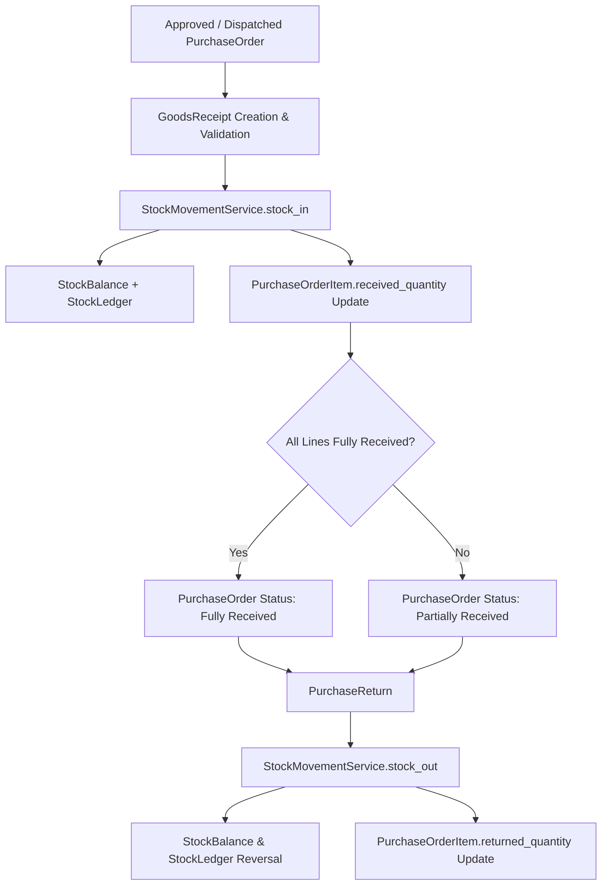

# Logistics & Receiving Architecture (v0.7.3)

## 1. Executive Summary

Milestone **v0.7.3 — Logistics & Receiving** provides the authoritative domain integration bridge between **Procurement** and **Inventory** in ApnaERP.

It enables physical stock receiving against approved or dispatched commercial `PurchaseOrder`s through canonical `GoodsReceipt` generation and `StockMovementService.stock_in` physical mutation, while maintaining accurate item-level received and returned quantity tracking, batch and serial tracking compatibility, and a complete purchase return workflow (`PurchaseReturn` with `StockMovementService.stock_out`).

---

## 2. Core Business Flow & Architecture

---

## 3. Purchase Order Receiving

### 3.1 Eligibility & Guard Constraints
Receiving is allowed only when a `PurchaseOrder`:
- Exists in the system.
- Is in `Approved`, `Dispatched`, or `Partially Received` status (Draft, Submitted, Rejected, Cancelled, or Closed orders are strictly rejected).
- Belongs to an active, non-blacklisted `Supplier`.
- Targets valid, active products and active warehouses.

### 3.2 Over-Receiving Protection
For every line item, the remaining allowable quantity is authoritatively calculated as:
$$\text{remaining\_quantity} = \text{ordered\_quantity} - \text{received\_quantity} + \text{returned\_quantity}$$

Any receiving attempt where $\text{received\_quantity} > \text{remaining\_quantity}$ is rejected with a `ValidationException`.

### 3.3 Partial & Sequential Receiving
- Supports multi-step receipts against a single `PurchaseOrder`.
- If partial quantity is received, `PurchaseOrderItem.status` becomes `Partially Received`, and `PurchaseOrder.status` transitions to `Partially Received`.
- Once all PO line items have $\text{received\_quantity} \ge \text{ordered\_quantity}$, `PurchaseOrder.status` automatically updates to `Fully Received`.

### 3.4 Multi-Line Receiving Atomicity & Concurrency Protection
- Multiple line items are grouped into a single `GoodsReceipt`.
- The `PurchaseOrder` and its line items are locked using database row-level locking (`SELECT ... FOR UPDATE` via `purchase_order_repository.get_for_update`) to prevent race conditions during concurrent receipts.
- All physical movements and quantity updates execute inside a single atomic transaction. If any line fails validation or stock allocation, the entire receipt rolls back cleanly.

---

## 4. Batch & Serial Number Receiving

Reuses the canonical v0.6.3 advanced inventory engine:
- **Batch-tracked items**: If a product has `is_batch_tracked = True`, batch information (`batch_number`, `expiry_date`, `manufacturing_date` or `batch_id`) is required. Creates or increments active `Batch` records and links them to the resulting `StockLedger` entries.
- **Serial-tracked items**: If a product has `is_serial_tracked = True`, unique serial numbers matching the exact integer quantity are required. Serial status transitions to `Available` at the target warehouse and location, with full history logging. Duplicate serials or reuse of active available serials are rejected.

---

## 5. Purchase Returns

### 5.1 Business Purpose & Lifecycle
`PurchaseReturn` allows returning defective, damaged, or incorrect goods that were previously received from a supplier.

Lifecycle states:
$$\text{Draft} \longrightarrow \text{Approved} \longrightarrow \text{Processed} \quad (\text{or } \text{Cancelled})$$

### 5.2 Return Validation Rules
- PO must exist and have $\text{received\_quantity} > 0$.
- Supplier and warehouse must match the original order.
- Line items must belong to the PO.
- Quantity check: $\text{return\_quantity} \le (\text{received\_quantity} - \text{returned\_quantity})$.

### 5.3 Stock Reversal Execution
- Processing a return calls `StockMovementService.stock_out(...)` with `commit=False`.
- Deducts `StockBalance.available_quantity` and creates a `StockLedger` entry with `direction="OUT"` and `reference_type="PurchaseReturn"`.
- Increments `PurchaseOrderItem.returned_quantity` by the returned amount.
- Commits atomically within a row-locked transaction.

---

## 6. Domain Boundaries & Separation of Concerns

| Domain | Entities Owned | Responsibilities |
|---|---|---|
| **Procurement** | `PurchaseOrder`, `PurchaseOrderItem`, `PurchaseReturn`, `PurchaseReturnItem`, `Supplier`, `RFQ`, `PurchaseRequisition` | Commercial agreements, receiving orchestration, return tracking, vendor communication. |
| **Inventory** | `GoodsReceipt`, `GoodsReceiptItem`, `StockBalance`, `StockLedger`, `StockMovementService`, `Batch`, `SerialNumber` | Physical inventory mutation, balance calculations, ledger immutability, warehouse locations. |
| **Finance (Out of Scope)** | *Invoices, AP, Payments, GL entries* | Deferred to Finance milestone. Receiving/Returns produce zero financial or GL ledger postings. |
| **Analytics (Out of Scope)** | *Spend Analytics, Dashboards, BI* | Deferred to milestone v0.7.4. |

---

## 7. RBAC Permissions Matrix

| Permission | Role Access | Description |
|---|---|---|
| `procurement.receiving.read` | Admin, Procurement Manager, Procurement Officer, Procurement Viewer | View Goods Receipts and PO receipt history |
| `procurement.receiving.create` | Admin, Procurement Manager, Procurement Officer | Create and post Goods Receipts against POs |
| `procurement.receiving.post` | Admin, Procurement Manager | Post and execute Goods Receipts into Inventory |
| `procurement.purchase_return.read` | Admin, Procurement Manager, Procurement Officer, Procurement Viewer | View Purchase Returns |
| `procurement.purchase_return.create` | Admin, Procurement Manager, Procurement Officer | Create Purchase Return drafts |
| `procurement.purchase_return.update` | Admin, Procurement Manager, Procurement Officer | Edit Draft Purchase Returns |
| `procurement.purchase_return.approve` | Admin, Procurement Manager | Approve Purchase Returns |
| `procurement.purchase_return.post` | Admin, Procurement Manager | Process / post Purchase Returns and execute stock reversal |
| `procurement.purchase_return.cancel` | Admin, Procurement Manager | Cancel Draft or Approved Purchase Returns |

---

## 8. Audit Logging

All receiving and return events are recorded in `AuditLog`:
- `PURCHASE_RECEIPT_CREATE`: Logged when a GoodsReceipt is initialized.
- `PURCHASE_RECEIPT_POST`: Logged upon successful stock execution.
- `PURCHASE_ORDER_PARTIAL_RECEIVE`: Logged when a PO is partially received.
- `PURCHASE_ORDER_FULLY_RECEIVED`: Logged when a PO is fully received.
- `PURCHASE_RETURN_CREATE`: Logged on return draft creation.
- `PURCHASE_RETURN_POST`: Logged on return processing and stock reversal.
- `PURCHASE_RETURN_CANCEL`: Logged when a return is cancelled.

---

## 9. API Reference

### Receiving Endpoints
- `POST /api/v1/purchase-orders/{po_id}/receive` (or `POST /api/v1/purchase-orders/{po_id}/receipts`): Receives physical goods against PO.
- `GET /api/v1/purchase-orders/{po_id}/receipts`: Lists all GoodsReceipts created against the specified PO.

### Purchase Return Endpoints
- `POST /api/v1/purchase-returns`: Creates a Purchase Return request.
- `GET /api/v1/purchase-returns`: Paginated listing with filters (`supplier_id`, `purchase_order_id`, `status`).
- `GET /api/v1/purchase-returns/{return_id}`: Retrieves a return by ID with item details.
- `PATCH /api/v1/purchase-returns/{return_id}`: Updates a Draft Purchase Return.
- `POST /api/v1/purchase-returns/{return_id}/approve`: Approves a Draft return.
- `POST /api/v1/purchase-returns/{return_id}/post` (or `POST .../process`): Processes the return, executes physical stock reversal, and updates PO returned counters.
- `POST /api/v1/purchase-returns/{return_id}/cancel`: Cancels a Draft or Approved return.
