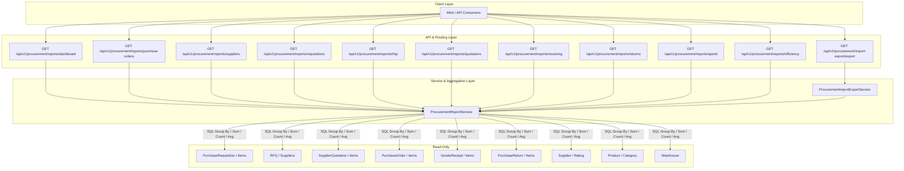

# Procurement Finalization & Analytics Architecture (v0.7.4)

## 1. Executive Summary

Milestone **v0.7.4 — Procurement Finalization & Analytics** is the final, read-only reporting and operational intelligence layer of the **Procurement** domain in ApnaERP.

It delivers aggregated dashboards, tabular operational reports, spend summaries, conversion/efficiency metrics, and streaming CSV exports across all sourcing, purchasing, receiving, and return entities without altering any business or inventory state.

Following v0.7.4, the **Procurement domain is complete and frozen**.

---

## 2. Core Architectural Principles & Boundaries

### 2.1 Read-Only Guarantee
- All report and analytics endpoints are strictly **read-only** (`GET` operations).
- No database rows are created, modified, or deleted in any procurement, inventory, or platform table.
- Read-only execution invariance is enforced and tested against baseline row counts across `Supplier`, `PurchaseOrder`, `GoodsReceipt`, `PurchaseReturn`, `StockBalance`, and `StockLedger`.

### 2.2 Finance Domain Boundary
- Spend analytics represent **operational procurement commercial totals** (sum of `PurchaseOrder.total_amount`).
- Reporting strictly avoids financial accounting abstractions:
  - **NO** Accounts Payable (AP) ledger calculations or vendor balances.
  - **NO** General Ledger (GL) journals or accounting entries.
  - **NO** Cost of Goods Sold (COGS) allocations.
  - **NO** Supplier invoice matching or invoice approvals (reserved for Finance domain).

### 2.3 Inventory Domain Boundary
- Inventory state remains immutable during reporting.
- Physical stock movements (`StockMovementService`), ledger records (`StockLedger`), and balances (`StockBalance`) are queried strictly for read verification and reconciliation.

---

## 3. Operational Reports & Analytics Reference

### 3.1 Procurement Dashboard (`/reports/dashboard`, `/analytics/dashboard-summary`)
Provides real-time operational posture across the entire procurement lifecycle:
- **Supplier Base**: Total suppliers, active count, blacklisted count.
- **Sourcing Activity**: Open requisitions, submitted requisitions, pending approvals, open RFQs, submitted quotations, approved/awarded quotations.
- **Commercial Purchasing**: Active PO count, dispatched PO count, partially received POs, fully received POs.
- **Physical Logistics**: Total ordered quantity, total received quantity, total returned quantity.
- **Commercial Spend**: Gross operational purchasing spend (`total_purchasing_spend`).

### 3.2 Purchase Order Summary Report (`/reports/purchase-orders`, `/purchase-register`)
Detailed tabular report with line-item and header-level aggregations:
- **Attributes**: PO Number, Supplier name, Order Date, Status, Currency, Subtotal, Discount, Tax, Total Amount, Warehouse name, Total Ordered Qty, Total Received Qty, Total Returned Qty.
- **Filters**: `supplier_id`, `warehouse_id`, `product_id`, `status`, `date_from`, `date_to`, `page`, `page_size`.

### 3.3 Supplier Performance Report (`/reports/suppliers`, `/supplier-ledger`)
Supplier-level scorecard grounded in transactional records:
- **Attributes**: Supplier Code, Name, Rating (`SupplierRating`), Active status, Total POs, Total Order Value (`total_po_amount`), Ordered Quantity, Received Quantity, Returned Quantity, On-time delivery rate, Fulfillment rate ($\text{received} / \text{ordered}$).
- **Filters**: `supplier_id`, `is_active`, `page`, `page_size`.

### 3.4 Purchase Requisition Report (`/reports/requisitions`)
Internal requisition pipeline visibility:
- **Attributes**: PR Number, Title, Requester, Department, Priority, Status, Required By Date, Estimated Total Amount, Items Count.
- **Summary Metrics**: Total PRs, counts by status (Draft, Submitted, Approved, Rejected, Cancelled), total estimated value.
- **Filters**: `department_id`, `requester_id`, `status`, `priority`, `date_from`, `date_to`.

### 3.5 RFQ & Sourcing Report (`/reports/rfqs`)
Vendor competition and negotiation monitoring:
- **Attributes**: RFQ Number, Title, Status, Issue Date, Close Date, Suppliers Invited Count, Quotations Received Count, Awarded Quotation Number, Awarded Amount.
- **Summary Metrics**: Total RFQs, Issued count, Closed count, Participation rate.
- **Filters**: `status`, `date_from`, `date_to`.

### 3.6 Supplier Quotation Report (`/reports/quotations`)
Vendor bid comparison and commercial proposals:
- **Attributes**: Quotation Number, Supplier Name, RFQ Number, Status, Currency, Subtotal, Tax, Total Amount, Valid Until, Payment Terms, Lead Time (Days), Items Count.
- **Filters**: `rfq_id`, `supplier_id`, `status`, `date_from`, `date_to`.

### 3.7 Receiving Performance Report (`/reports/receiving`)
Warehouse dock receipt and inbound fulfillment analytics:
- **Attributes**: GR Number, PO Number, Supplier Name, Warehouse Name, Receipt Date, Total Received Qty, Total Rejected Qty, Items Count.
- **Summary Metrics**: Overall receiving fulfillment rate ($\text{total received} / \text{total ordered}$), partially vs. fully received PO distributions.
- **Filters**: `po_id`, `supplier_id`, `warehouse_id`, `date_from`, `date_to`.

### 3.8 Purchase Return Report (`/reports/returns`)
Vendor returns and defect monitoring:
- **Attributes**: Return Number, PO Number, Goods Receipt Number, Supplier Name, Warehouse Name, Return Date, Total Returned Qty, Status, Reason.
- **Summary Metrics**: Total return count, total returned units, return rate ($\text{returned qty} / \text{received qty}$).
- **Filters**: `po_id`, `supplier_id`, `warehouse_id`, `status`, `date_from`, `date_to`.

### 3.9 Spend Analytics (`/reports/spend`, `/analytics/spend`)
Commercial purchasing expenditure breakdown:
- **Total Operational Spend**: Aggregate value of non-cancelled purchase orders.
- **By Supplier**: Top suppliers ranked by commercial PO value.
- **By Warehouse**: PO distribution across receiving facilities.
- **By Status**: Order volume and value per approval/fulfillment stage.
- **By Month**: Historical monthly purchasing run-rate (`YYYY-MM`).
- **Filters**: `supplier_id`, `warehouse_id`, `date_from`, `date_to`.

### 3.10 Procurement Efficiency & Conversion Metrics (`/reports/efficiency`)
End-to-end pipeline velocity and conversion ratios:
- $\text{Participation Rate} = \frac{\text{Quotations Received}}{\text{Suppliers Invited}}$
- $\text{Average Quotations Per RFQ} = \frac{\text{Total Quotations}}{\text{Total RFQs}}$
- $\text{Quotation Award Ratio} = \frac{\text{Awarded Quotations}}{\text{Total Submitted Quotations}}$
- $\text{Award to PO Conversion Ratio} = \frac{\text{POs Created}}{\text{Awarded Quotations}}$
- $\text{PO Completion Ratio} = \frac{\text{Fully Received POs}}{\text{Total Approved POs}}$
- $\text{Return Ratio} = \frac{\text{Total Returned Qty}}{\text{Total Received Qty}}$

---

## 4. Export Capabilities (`/import-export/export`)

The system provides synchronous, streaming CSV exports for all major procurement datasets:
- `purchase_orders` / `po`: Purchase order summary register.
- `suppliers`: Supplier performance scorecard.
- `receiving` / `goods_receipts`: Goods receipts summary.
- `returns` / `purchase_returns`: Purchase returns register.
- `requisitions`: Purchase requisition log.
- `quotations`: Supplier quotation register.
- `rfqs`: Sourcing RFQ register.

All CSV generation utilizes standard CSV formatting with automatic field escaping and streaming `StreamingResponse` transmission to protect server memory.

---

## 5. Security & RBAC Configuration

All endpoints are protected via token authentication and granular permissions:

| Endpoint | Method | Required Permission | Allowed Roles |
|---|---|---|---|
| `/api/v1/procurement/reports/dashboard` | `GET` | `procurement.reports.read` | Admin, Procurement Manager, Procurement Viewer |
| `/api/v1/procurement/reports/purchase-orders` | `GET` | `procurement.reports.read` | Admin, Procurement Manager, Procurement Viewer |
| `/api/v1/procurement/reports/suppliers` | `GET` | `procurement.reports.read` | Admin, Procurement Manager, Procurement Viewer |
| `/api/v1/procurement/reports/requisitions` | `GET` | `procurement.reports.read` | Admin, Procurement Manager, Procurement Viewer |
| `/api/v1/procurement/reports/rfqs` | `GET` | `procurement.reports.read` | Admin, Procurement Manager, Procurement Viewer |
| `/api/v1/procurement/reports/quotations` | `GET` | `procurement.reports.read` | Admin, Procurement Manager, Procurement Viewer |
| `/api/v1/procurement/reports/receiving` | `GET` | `procurement.reports.read` | Admin, Procurement Manager, Procurement Viewer |
| `/api/v1/procurement/reports/returns` | `GET` | `procurement.reports.read` | Admin, Procurement Manager, Procurement Viewer |
| `/api/v1/procurement/reports/spend` | `GET` | `procurement.reports.read` | Admin, Procurement Manager, Procurement Viewer |
| `/api/v1/procurement/reports/efficiency` | `GET` | `procurement.reports.read` | Admin, Procurement Manager, Procurement Viewer |
| `/api/v1/procurement/analytics/*` | `GET` | `procurement.analytics.read` | Admin, Procurement Manager, Procurement Viewer |
| `/api/v1/procurement/import-export/export` | `GET` | `procurement.import_export.execute` | Admin, Procurement Manager |

---

## 6. Procurement Domain Complete & Frozen

With milestone **v0.7.4**, all four procurement lifecycle phases are fully implemented, verified, and sealed:
1. **v0.7.0**: Foundation & Supplier Master Management
2. **v0.7.1**: Sourcing, Requisitions & RFQ/Quotation Management
3. **v0.7.2**: Commercial Purchasing & Multi-tier Purchase Orders
4. **v0.7.3**: Inbound Logistics, Goods Receipt & Returns Bridge
5. **v0.7.4**: Read-only Reporting, Spend Analytics & Operational KPIs
